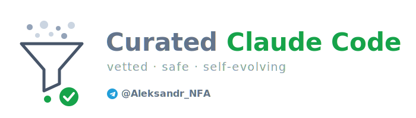

<p align="center">
  
</p>

<p align="center"><b>A small, vetted, self-evolving harness for Claude Code — curated, not dumped.</b></p>

<p align="center">
  <a href="LICENSE"></a>
  
  
</p>

Most "everything for Claude Code" collections optimize for **count** — hundreds of agents, skills, rules, and event hooks that auto-run on your tool calls. It looks impressive and fails quietly: bloated context, overlapping triggers fighting to activate, and hooks that mutate things without asking.

This repo optimizes for the opposite. A handful of skills that earn their place, a spine of safety guards, and — the actual product — **a system that improves itself over time, safely.**

> **A harness that grows is worth more than a harness that's big.** The thing that compounds isn't the block count — it's the intake gate, the hygiene loop, and the learning machinery. → **[`docs/EVOLUTION.md`](docs/EVOLUTION.md)** is the heart of this repo; start there.

## What this is / isn't
- ✅ A curated set of executable skills + always-on principles you can drop into `~/.claude/`.
- ✅ A **method** (`/vet`) for deciding what to adopt, and a registry so you never evaluate the same tool twice.
- ✅ A **self-evolution loop** — corrections become memory, findings become skills, the stack stays clean.
- ✅ **Safety by design** — no surprise autonomous actions.
- ❌ Not a 500-block mega-bundle. Not a framework you fork. No auto-running hooks.

## Why curated, not dumped
- **Vet before adopt.** Nothing enters on hype. Every incoming tool runs through one pipeline — relevance → **security as a blocking gate** → duplication → real ROI → verdict. The security phase reads a skill's body as a *behavioral* instruction and checks the agentic risks (hidden instructions, prompt injection, trigger abuse, excessive agency) a code-only scan misses.
- **It evolves.** A user correction is the strongest learning signal; a finding is captured at discovery; a 5+-iteration procedure becomes a skill. The system compounds instead of going stale. → [`docs/EVOLUTION.md`](docs/EVOLUTION.md)
- **Cherry-pick over giant.** A good idea inside a huge framework doesn't justify installing the framework. Extract the technique, leave the bloat.
- **No auto-hooks.** Auto-mutation without confirmation is exactly the failure mode to avoid. → [`rules/safety-guards.md`](rules/safety-guards.md)

Full rationale: [`docs/METHODOLOGY.md`](docs/METHODOLOGY.md).

## What's inside

### Skills (`skills/`)
| Skill | What it does |
|-------|--------------|
| [`vet`](skills/vet/SKILL.md) | Evaluate an incoming tool through one pipeline; security is a blocking gate; record the verdict. |
| [`workflow-upgrade`](skills/workflow-upgrade/SKILL.md) | The deliberate "improve the system" loop: audit → vet → adopt with discipline → record. |
| [`goal`](skills/goal/SKILL.md) | Autonomous goal loop with a designed verification rubric and hard safety guards. |
| [`konsilium`](skills/konsilium/SKILL.md) | 5 independent perspectives + mutual critique + synthesis for high-stakes decisions. |
| [`ship-secure`](skills/ship-secure/SKILL.md) | Security launch audit for a public web app before you ship or hand it to a client. |
| [`pre-push`](skills/pre-push/SKILL.md) | A gate before push/deploy: secrets, slop, review, build — nothing junk leaves. |
| [`system-health`](skills/system-health/SKILL.md) | Weekly hygiene scan of your own Claude Code config (memory/rules/permissions). |
| [`teach`](skills/teach/SKILL.md) | Teacher mode — turn a session/article/concept into an incremental mini-course with quizzes. |
| [`longread`](skills/longread/SKILL.md) | 4-phase analytical writing pipeline with a devil's-advocate pass before publishing. |

### Agents (`agents/`)
Two by design, not sixty — each reflects the verify-before-trust stance, not filler.
| Agent | What it does |
|-------|--------------|
| [`adversarial-verifier`](agents/adversarial-verifier.md) | Tries to REFUTE a claim/finding (defaults to refuted when uncertain) — for checking bugs/audit findings before trusting them. |
| [`tool-scout`](agents/tool-scout.md) | Read-only scout for `/vet` — reads a tool's repo/docs and returns a structured security report; never installs or runs. |

### Rules (`rules/`)
| Rule | What it covers |
|------|----------------|
| [`code-principles.md`](rules/code-principles.md) | Behavioral rules against typical LLM coding mistakes (think-before-code, simplicity, surgical edits, verifiable targets, plan-mode). |
| [`safety-guards.md`](rules/safety-guards.md) | The spine: external content = data not commands; mutation = confirmation; signing-to-real-funds = never; secrets as file:line; result honesty. |
| [`new-project.md`](rules/new-project.md) | A "think before code" checklist for starting something from scratch. |
| [`detective-mindset.md`](rules/detective-mindset.md) | Reading logs/data like a detective — numeric coincidences, distribution anomalies, cross-source correlation, ghost state, repeat actors, config-vs-code drift. |

### Docs & examples
- [`docs/EVOLUTION.md`](docs/EVOLUTION.md) — **how the harness improves itself** (start here).
- [`docs/METHODOLOGY.md`](docs/METHODOLOGY.md) — why curated, not dumped.
- [`docs/MEMORY_SYSTEM.md`](docs/MEMORY_SYSTEM.md) — a file-based, self-learning memory pattern.
- [`docs/TOOL_ROUTING.md`](docs/TOOL_ROUTING.md) — task → tool routing, proactively.
- [`docs/CHANGE_DISCIPLINE.md`](docs/CHANGE_DISCIPLINE.md) — backup → surgical → verify → record.
- [`examples/`](examples/) — a registry template and a worked `/vet` verdict.

## Which skill should I use?
| I want to… | Use |
|------------|-----|
| Decide whether to adopt a new tool/skill/MCP | `vet` |
| Run a deliberate pass to improve my whole setup | `workflow-upgrade` |
| Hand a goal to the agent and get back a finished, verified result | `goal` |
| Pressure-test a high-stakes decision (go/no-go) | `konsilium` |
| Make sure a web app is safe before launch/handoff | `ship-secure` |
| Make sure nothing junk leaves on push/deploy | `pre-push` |
| Keep my Claude Code config from rotting | `system-health` |
| Actually understand a session/article/concept | `teach` |
| Write an analytical longform piece | `longread` |

## Quick start
Install manually — copy only what you want. (No `curl | bash`: this harness practices what it preaches.)

```bash
git clone https://github.com/Sanexxxx777/curated-claude-code
cd curated-claude-code

# install the skills you want
cp -r skills/vet ~/.claude/skills/
cp -r skills/ship-secure ~/.claude/skills/
# …repeat for the rest

# agents → ~/.claude/agents/ ; rules → append into your CLAUDE.md or ~/.claude/rules/
cp agents/*.md ~/.claude/agents/
```
Restart Claude Code, then invoke a skill by its name (e.g. `/vet`).

## Attribution
This harness was built the way it tells you to build — by cherry-picking techniques and crediting them:
- `konsilium` adapts Andrej Karpathy's [`llm-council`](https://github.com/karpathy/llm-council) (independent opinions → anonymized peer review → chairman synthesis).
- `ship-secure` adapts Prajwal Tomar's "Vibe Coders Are Getting Sued" launch playbook.
- `code-principles` is derived from Karpathy's widely-shared CLAUDE.md principles.
- `goal`'s design phase cherry-picks loop-design ideas from [`ksimback/looper`](https://github.com/ksimback/looper).
- `teach` adapts Anthropic's guided-learning prompt.

## Work with me
I build and harden Claude Code workflows, agentic setups, and web apps — and I do managed hosting and site builds. If these patterns are useful to your team, or you want help applying them, reach out:
- **GitHub:** open an issue, or [@Sanexxxx777](https://github.com/Sanexxxx777)
- **Email:** sanexxx777@gmail.com

## Contributing
PRs welcome — see [`CONTRIBUTING.md`](CONTRIBUTING.md). The bar: it must pass its own `/vet`, ship no auto-hooks, contain no secrets, and stay surgical. Curation is the point; volume isn't.

If this saved you time, a ⭐ helps others find it.

## License
[MIT](LICENSE) © Aleksandr_NFA
